# BharatSolve AI — Architecture Documentation

---

## Table of Contents

1. [Application Architecture](#1-application-architecture)
2. [Infrastructure Architecture](#2-infrastructure-architecture)
3. [Combined Complete Architecture](#3-combined-complete-architecture)
4. [Data Flow Diagrams](#4-data-flow-diagrams)
5. [Database Schema](#5-database-schema)
6. [Security Architecture](#6-security-architecture)

---

## 1. Application Architecture

### 1.1 High-Level Application Architecture

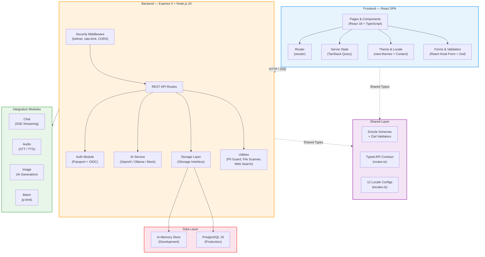

### 1.2 Frontend Component Architecture

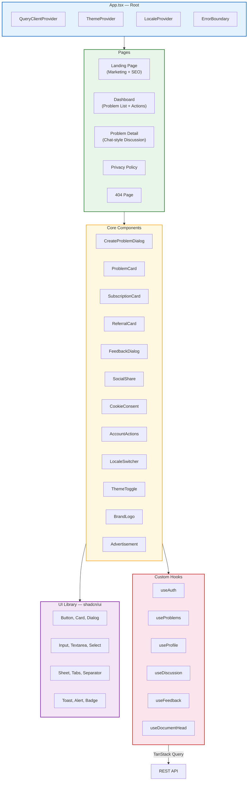

### 1.3 Backend Module Architecture

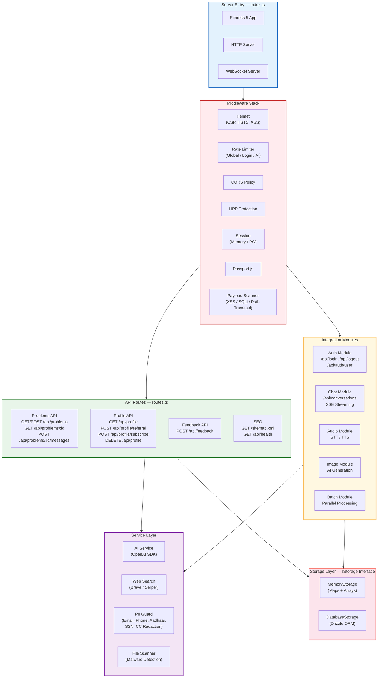

### 1.4 AI Processing Pipeline

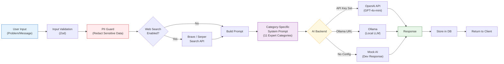

---

## 2. Infrastructure Architecture

### 2.1 AWS Production Infrastructure

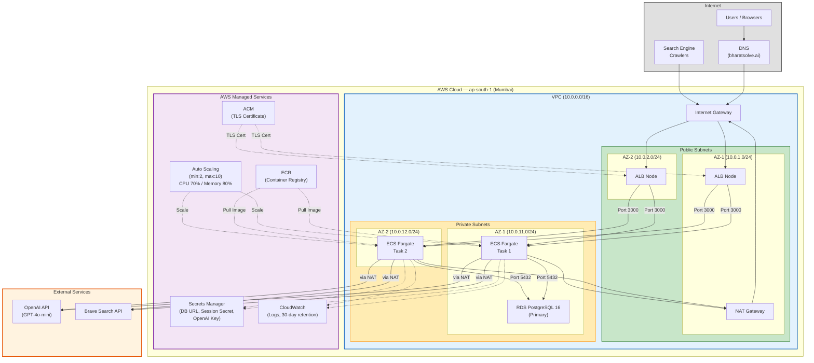

### 2.2 Network & Security Groups

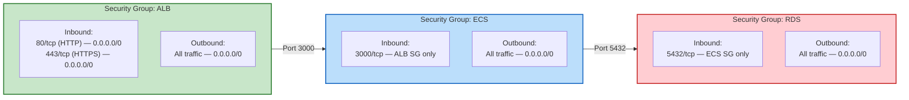

### 2.3 Docker Build Pipeline (Multi-Stage)

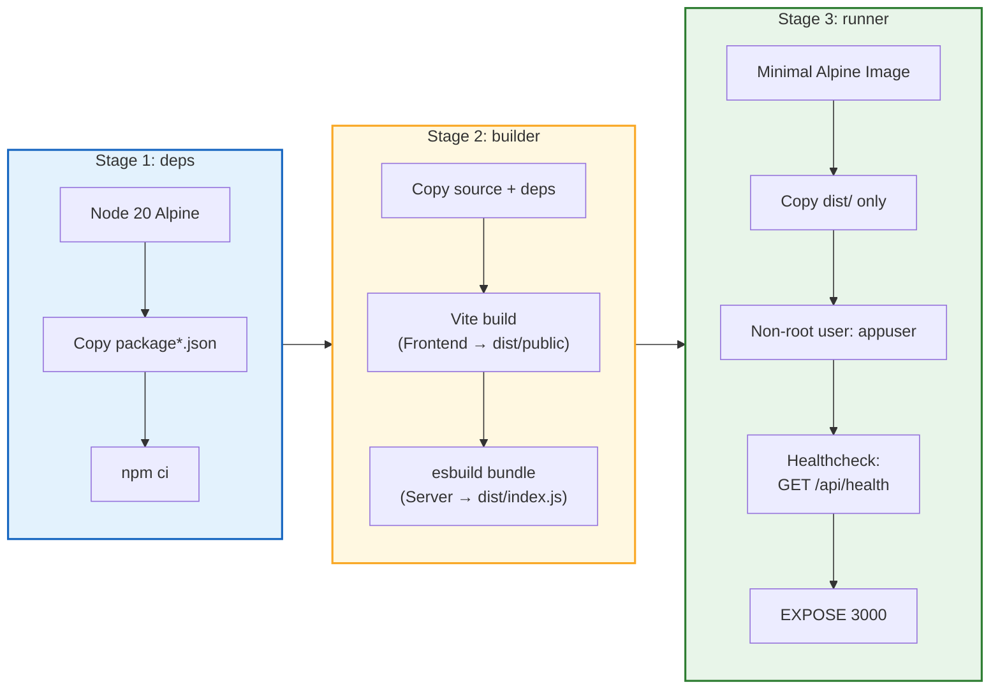

### 2.4 Local Development Stack (docker-compose)

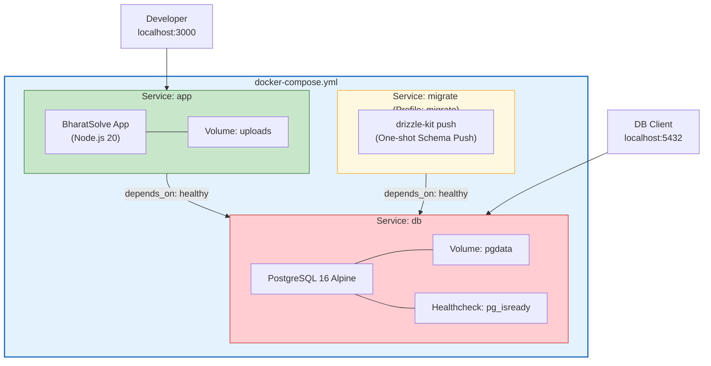

---

## 3. Combined Complete Architecture

### 3.1 End-to-End System Architecture

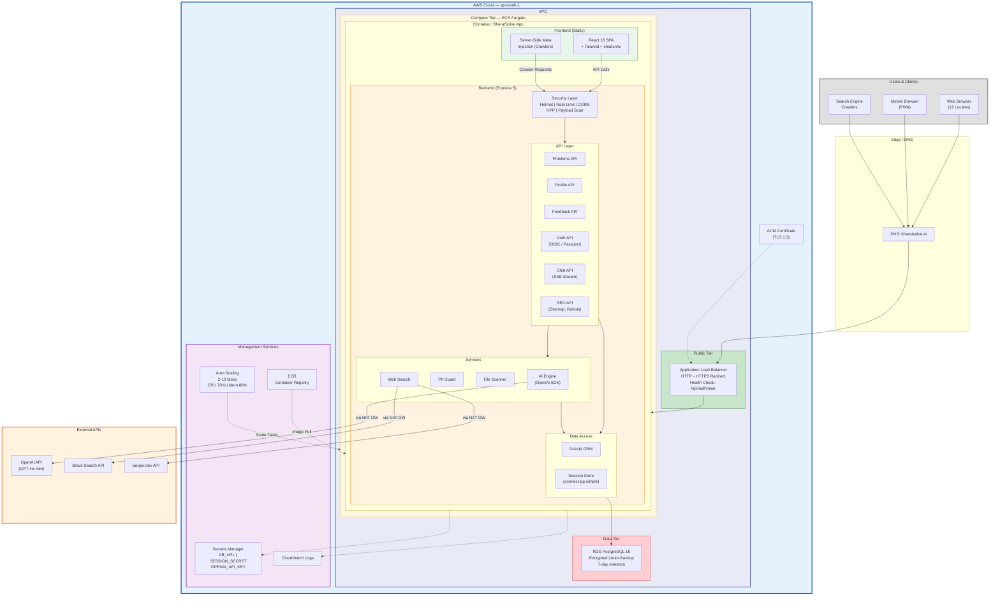

### 3.2 Request Lifecycle (Sequence Diagram)

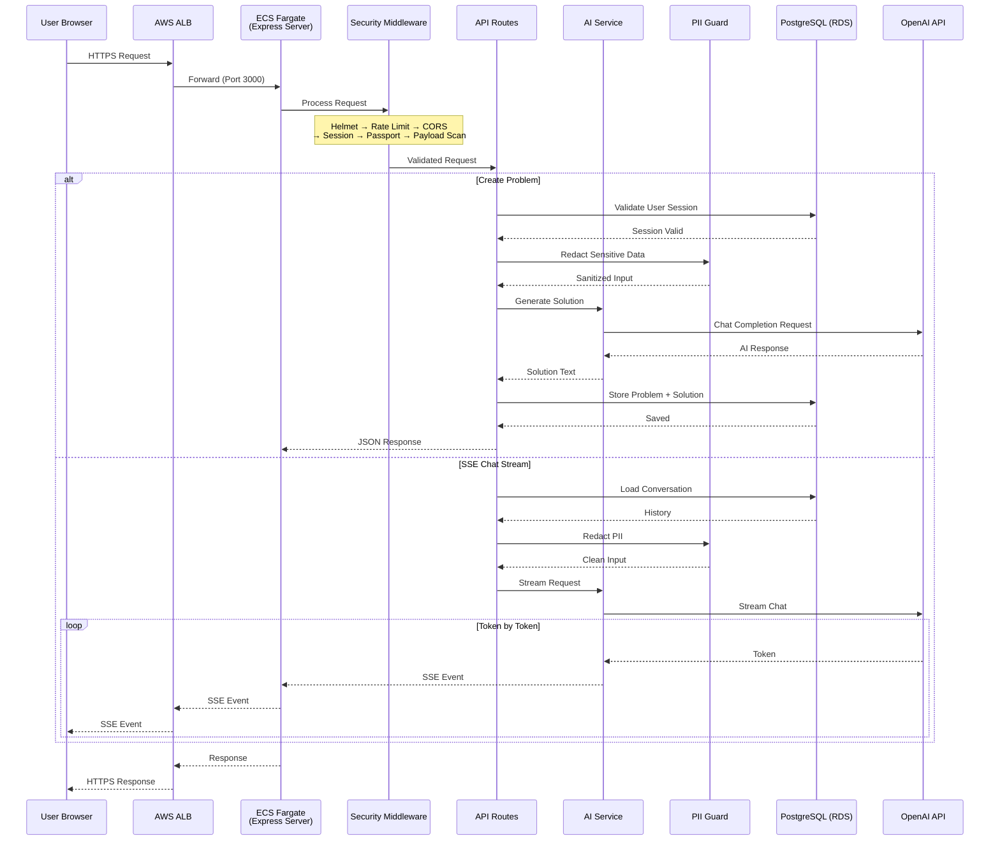

### 3.3 Multi-Locale Architecture

```mermaid
graph TB
    subgraph Detection["Locale Detection"]
        TZ["Browser Timezone"]
        Lang["Browser Language"]
        Manual["Manual Selection"]
    end

    subgraph LocaleEngine["Locale Engine — 12 Countries"]
        IN["🇮🇳 India<br/>BharatSolve<br/>Hindi/English<br/>₹499/mo"]
        SG["🇸🇬 Singapore<br/>SolveSG<br/>English/Mandarin<br/>S$12/mo"]
        HK["🇭🇰 Hong Kong<br/>SolveHK<br/>Cantonese/English<br/>HK$78/mo"]
        JP["🇯🇵 Japan<br/>SolveJP<br/>Japanese<br/>¥1,480/mo"]
        CN["🇨🇳 China<br/>SolveCN<br/>Mandarin<br/>¥35/mo"]
        US["🇺🇸 USA<br/>SolveUS<br/>English<br/>$9.99/mo"]
        GB["🇬🇧 UK<br/>SolveUK<br/>English<br/>£7.99/mo"]
        KR["🇰🇷 Korea<br/>SolveKR<br/>Korean<br/>₩12,900/mo"]
        AE["🇦🇪 UAE<br/>SolveAE<br/>Arabic/English<br/>AED 36/mo"]
        AU["🇦🇺 Australia<br/>SolveAU<br/>English<br/>A$14.99/mo"]
        DE["🇩🇪 Germany<br/>SolveDE<br/>German<br/>€8.99/mo"]
        BR["🇧🇷 Brazil<br/>SolveBR<br/>Portuguese<br/>R$49/mo"]
    end

    subgraph Customization["Per-Locale Customization"]
        Branding["App Name + Theme Colors"]
        Prompts["Culturally-Tuned<br/>AI System Prompts"]
        Content["Testimonials, FAQ,<br/>Use Cases, Features"]
        Pricing["Currency + Pricing"]
    end

    Detection --> LocaleEngine
    LocaleEngine --> Customization

    style Detection fill:#e3f2fd,stroke:#1565c0,stroke-width:2px
    style LocaleEngine fill:#fff8e1,stroke:#f9a825,stroke-width:2px
    style Customization fill:#e8f5e9,stroke:#2e7d32,stroke-width:2px
```

---

## 4. Data Flow Diagrams

### 4.1 Authentication Flow

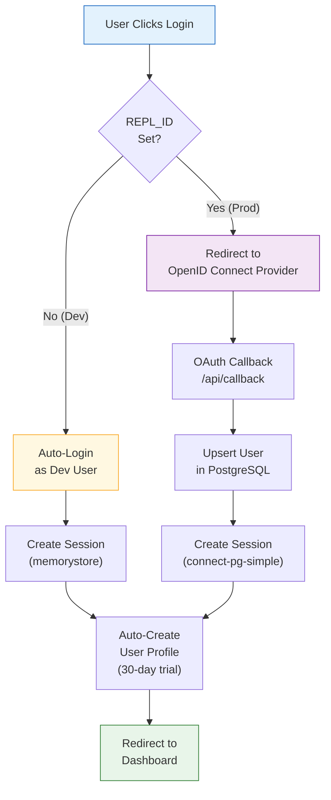

### 4.2 Problem Solving Flow

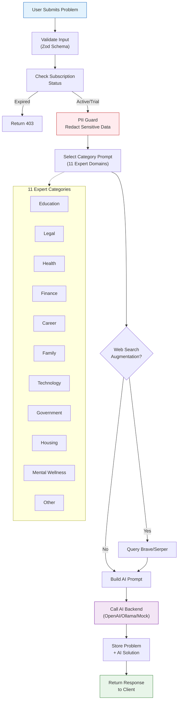

### 4.3 Subscription & Referral Flow

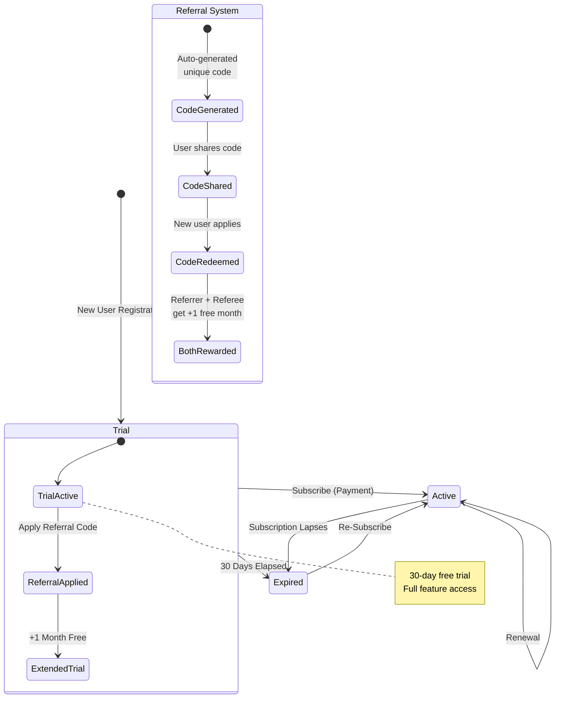

---

## 5. Database Schema

### 5.1 Entity Relationship Diagram

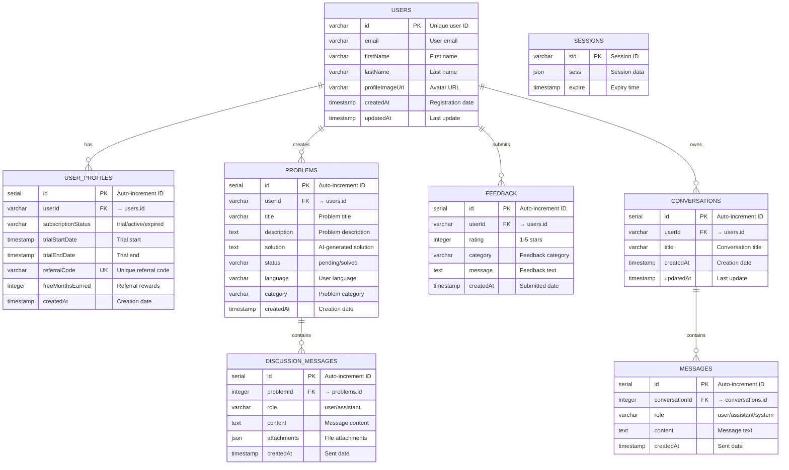

---

## 6. Security Architecture

### 6.1 Defense-in-Depth Layers

```mermaid
graph TB
    subgraph L1["Layer 1: Network"]
        VPCSec["VPC Isolation<br/>Public/Private Subnets"]
        SGRules["Security Groups<br/>Least-Privilege Rules"]
        TLS["TLS 1.3<br/>(ACM Certificate)"]
    end

    subgraph L2["Layer 2: Edge"]
        ALBSec["ALB<br/>HTTP→HTTPS Redirect"]
        WAF["Rate Limiting<br/>(200 req/15min global)"]
    end

    subgraph L3["Layer 3: Application"]
        HelmetSec["Helmet<br/>CSP, HSTS, X-Frame-Options"]
        CORSSec["CORS Policy"]
        HPPSec["HPP Protection"]
        PayloadSec["Payload Scanning<br/>XSS / SQLi / Path Traversal"]
        InputVal["Input Validation<br/>(Zod Schemas)"]
    end

    subgraph L4["Layer 4: Data"]
        PIISec["PII Redaction<br/>(Before AI Calls)"]
        SessionSec["Secure Sessions<br/>(httpOnly, sameSite)"]
        FileSecure["File Upload Scanning<br/>(Malware Detection)"]
        DBEncrypt["DB Encryption<br/>(At Rest)"]
        SecretsMgr["AWS Secrets Manager"]
    end

    subgraph L5["Layer 5: Runtime"]
        NonRoot["Non-root Container"]
        SizeLimit["Request Size Limits"]
        ErrMask["Production Error Masking"]
        LogAudit["CloudWatch Logging"]
    end

    L1 --> L2 --> L3 --> L4 --> L5

    style L1 fill:#e8f5e9,stroke:#2e7d32,stroke-width:2px
    style L2 fill:#e3f2fd,stroke:#1565c0,stroke-width:2px
    style L3 fill:#fff8e1,stroke:#f9a825,stroke-width:2px
    style L4 fill:#fce4ec,stroke:#c62828,stroke-width:2px
    style L5 fill:#f3e5f5,stroke:#7b1fa2,stroke-width:2px
```

### 6.2 Rate Limiting Strategy

| Endpoint Category | Limit | Window | Purpose |
|---|---|---|---|
| Global | 200 requests | 15 minutes | Prevent abuse |
| Login (`/api/login`) | 10 requests | 15 minutes | Brute-force protection |
| AI Endpoints (`/api/problems`, `/api/*/messages`) | 10 requests | 1 minute | Cost control + abuse prevention |

---

## Technology Stack Summary

| Layer | Technology | Version |
|---|---|---|
| **Frontend** | React + TypeScript + Vite + Tailwind + shadcn/ui | 18 / 5.6 / 7 / 3 |
| **Backend** | Node.js + Express + TypeScript | 20 / 5 / 5.6 |
| **Database** | PostgreSQL + Drizzle ORM | 16 |
| **AI** | OpenAI SDK (GPT-4o-mini) / Ollama | v6 |
| **Auth** | Passport.js + OpenID Connect | |
| **Container** | Docker (multi-stage, Alpine) | |
| **Orchestration** | AWS ECS Fargate | |
| **IaC** | Terraform | >= 1.5 |
| **Load Balancer** | AWS ALB (TLS 1.3) | |
| **Database Hosting** | AWS RDS PostgreSQL | 16.4 |
| **Secrets** | AWS Secrets Manager | |
| **Registry** | AWS ECR | |
| **Monitoring** | AWS CloudWatch | |
| **Region** | ap-south-1 (Mumbai) | |
